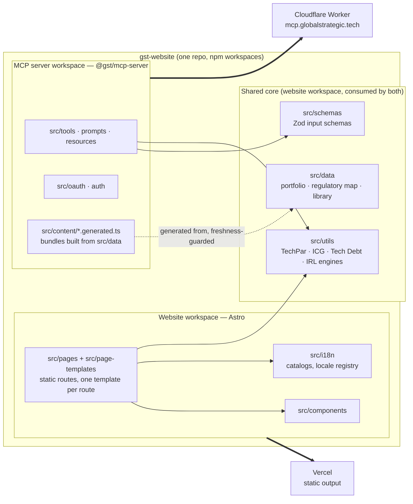
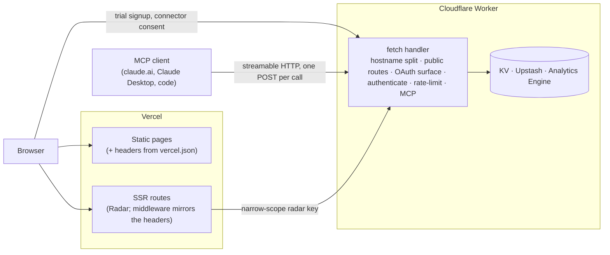
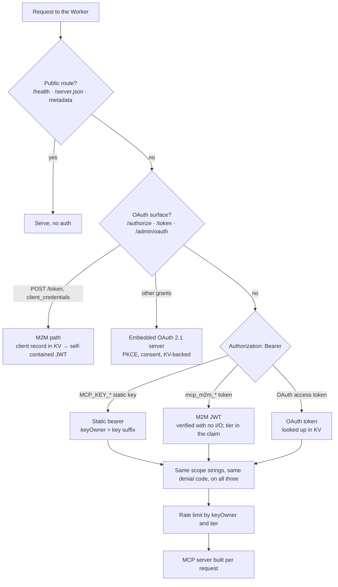

# Layer 1 — Software architecture (the foundation)

> Per the article: the engineering principles and patterns governing how code is organized, how components communicate, and how the system behaves under real conditions. It determines whether the higher layers' choices are achievable or aspirational, and it is the common source of hidden cost in acquisitions. Business meaning: developer productivity, defect rates, cost of change, security exposure.

The detail for the server half of this layer lives in [ARCHITECTURE.md](../../../mcp-server/src/docs/ARCHITECTURE.md). This file draws three views that span both halves.

## The estate map

One repository, two npm workspaces, two platforms, one shared core.

What the map is saying:

- **The engines are written once.** A Hub tool page in the browser and the same tool over MCP run the same `src/utils` module against the same `src/schemas` contract ([ADR-0025](../adr/0025-irl-extraction-in-the-browser.md) is the canonical instance: the IRL extractor's pure core moved _into_ the website workspace so both could import it).
- **Structured data crosses the boundary by generation, not import.** The Worker cannot read `src/data` at runtime, so the regulation corpus and library articles are compiled into `*.generated.ts` bundles; `test:docs` fails when a bundle is stale.
- **The server's own layout** — register-once/transport-twice, the request pipeline, the SDK choice — is [ARCHITECTURE.md § System shape](../../../mcp-server/src/docs/ARCHITECTURE.md#system-shape) and [§ Remote transport](../../../mcp-server/src/docs/ARCHITECTURE.md#remote-transport--request-flow); it is not redrawn here.

## Request paths across the estate

Two kinds of caller, two platforms, and one place they touch.

- The website is static except for the Radar routes, which render server-side and call the Worker with a narrow-scope bearer — the only server-to-server path in the estate.
- Browsers reach the Worker directly only for the self-serve trial and the OAuth consent page, which is why the Worker owns its own CORS policy ([ADR-0013](../adr/0013-mcp-2026-07-28-modern-only-worker.md)) and the website's CSP allows the Worker origins.
- Everything after the Worker's `fetch` is [ARCHITECTURE.md § Request pipeline](../../../mcp-server/src/docs/ARCHITECTURE.md#remote-transport--request-flow).

## The three auth paths, as a routing decision

[ARCHITECTURE.md § Auth](../../../mcp-server/src/docs/ARCHITECTURE.md#auth-cors--deploy-topology) explains each path; this is only how a request is routed to one of them.

The one structural fact worth keeping at this altitude: the M2M token carries its tier and is verified without a store read, because KV's cross-location visibility is on the order of a minute and a per-request lookup would have made that window part of every call ([ADR-0008](../adr/0008-mcp-oauth-embedded-authorization-server.md), [ADR-0010](../adr/0010-per-client-rate-limit-tiers.md), [ADR-0036](../adr/0036-client-records-stay-in-kv.md)).

## Where this layer is bound

| Concern                                  | Authoritative                                                                                                                                                                                                                                                                                                                                                                                                                                                                                                                                                                          |
| ---------------------------------------- | -------------------------------------------------------------------------------------------------------------------------------------------------------------------------------------------------------------------------------------------------------------------------------------------------------------------------------------------------------------------------------------------------------------------------------------------------------------------------------------------------------------------------------------------------------------------------------------- |
| Server system shape, transport, pipeline | [ARCHITECTURE.md](../../../mcp-server/src/docs/ARCHITECTURE.md)                                                                                                                                                                                                                                                                                                                                                                                                                                                                                                                        |
| Tool input contracts                     | [mcp-server/src/docs/tools/README.md](../../../mcp-server/src/docs/tools/README.md)                                                                                                                                                                                                                                                                                                                                                                                                                                                                                                    |
| Website tooling and validation sequence  | [DEVELOPER_TOOLING.md](../development/DEVELOPER_TOOLING.md)                                                                                                                                                                                                                                                                                                                                                                                                                                                                                                                            |
| Locale model                             | [LOCALIZATION.md](../development/LOCALIZATION.md), [ADR-0030](../adr/0030-website-locale-model.md)                                                                                                                                                                                                                                                                                                                                                                                                                                                                                     |
| ADRs                                     | [0001](../adr/0001-stage-taxonomy-adapter.md) · [0004](../adr/0004-hub-surface-resources-import-restriction.md) · [0005](../adr/0005-hub-url-state-deeplink-contract.md) · [0011](../adr/0011-tool-response-channel-policy.md) · [0013](../adr/0013-mcp-2026-07-28-modern-only-worker.md) · [0019](../adr/0019-irl-extract-record-subject-indexing.md) · [0020](../adr/0020-workers-types-global-shadowing-immunity.md) · [0021](../adr/0021-irl-fill-d-cell-sourcing-grammar.md) · [0025](../adr/0025-irl-extraction-in-the-browser.md) · [0030](../adr/0030-website-locale-model.md) |
