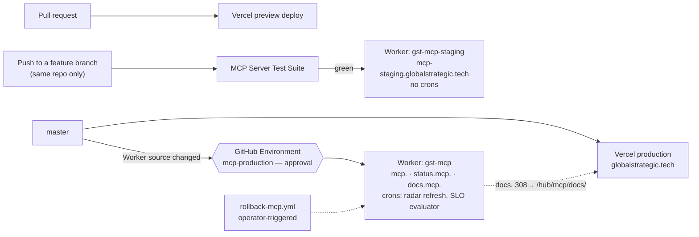
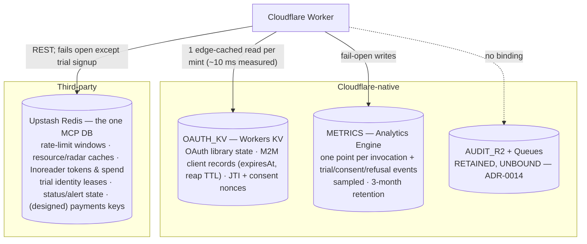
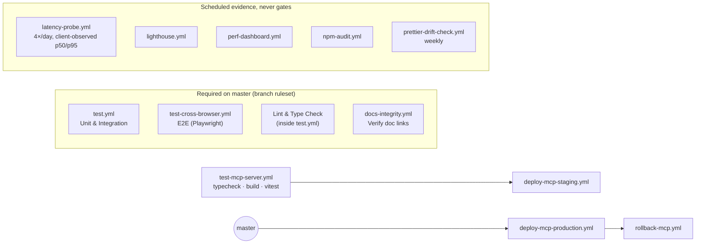
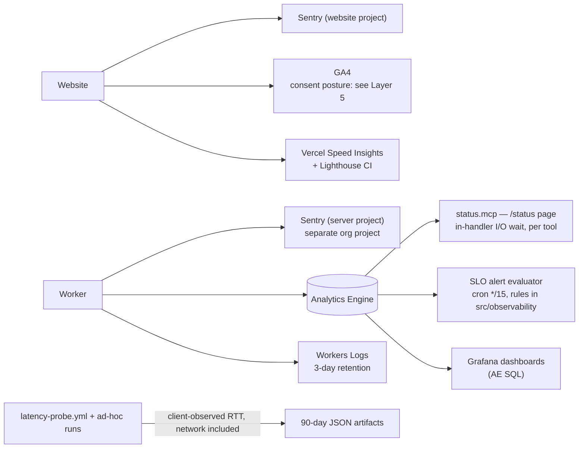

# Layer 2 — Operational architecture (infrastructure)

> Per the article: the cloud infrastructure, build-and-deploy pipelines, monitoring and incident response — the technology-specific expression of the fundamentals that govern factory floors and supply chains. The same product on different operations has radically different unit economics, reliability and speed. Business meaning: reliability and uptime, cost to operate, speed to ship, elasticity.

The server's deploy runbook is [DEPLOY.md](../../../mcp-server/src/docs/operations/DEPLOY.md) and its topology section is [ARCHITECTURE.md § Deploy topology](../../../mcp-server/src/docs/ARCHITECTURE.md#deploy-topology-q10). This file draws the four views that cross the platform boundary.

## Deploy topology, both platforms

- **The website has no approval gate**: merge to `master` is the deploy. **The Worker has one**: production waits on the `mcp-production` environment reviewer, with latest-wins concurrency so a stale run never overwrites a newer one.
- **Nobody rebuilds or redeploys the Worker by hand**; the pipeline is the only path, and rollback is its own workflow.
- One Worker serves three production hostnames, split inside `fetch`; the docs hostname redirects to the website ([ADR-0023](../adr/0023-mcp-capability-docs-rendering.md)).

## The storage estate

Drawn from the inventory in [ADR-0036](../adr/0036-client-records-stay-in-kv.md), which is where the decision and its triggers live.

- **Four stores, none relational; no D1, no Durable Objects.** The client record is the one thing in KV that is ours; every index it lacks (one-per-identity, customer→client) is a structure in Upstash beside it.
- **Two consistency models, deliberately.** KV is eventually consistent across locations (~60 s), which is why tokens are self-contained and why idempotency-sensitive state is specified for Upstash, not KV.
- `mcp:oauth:*` keys **look** like the Upstash families and are not in Upstash. Marked in the ADR because it has confused readers before.

## CI/CD — the twelve workflows

[DEVELOPER_TOOLING.md](../development/DEVELOPER_TOOLING.md) holds the pipeline map with triggers and path filters; this is the dependency picture.

- Four checks are **required** and the rest are evidence. The docs check exists separately because the test workflow skips itself on docs-only diffs.
- The MCP suite is not a required check on the website's ruleset, but a red run **suppresses the staging deploy**, which is the same effect one step later.
- The ad-hoc probe surfaces that measured ADR-0036 are in the same script as the scheduled probe and are excluded from its schedule by contract ([LATENCY_PROBE.md](../../../mcp-server/src/docs/operations/LATENCY_PROBE.md)).

## Observability, estate-wide

[ARCHITECTURE.md § Observability](../../../mcp-server/src/docs/ARCHITECTURE.md#observability) is the server's reference; this is where each signal goes across the estate.

- **Two latency truths coexist by design**: `/status` sees in-handler I/O wait and cannot see compute; the probe sees the round-trip a client experiences and is the only source that sees compute. Neither substitutes for the other ([LATENCY_PROBE.md § Operational notes](../../../mcp-server/src/docs/operations/LATENCY_PROBE.md#operational-notes)).
- **Metrics never break a request**: every AE write is fail-open, and per-client identity is a blob so the index stays roster-sized ([ADR-0031](../adr/0031-per-client-analytics-identity-is-a-blob.md)); refusals are emitted, allows are not ([ADR-0032](../adr/0032-rate-limit-decisions-emit-only-on-refusal.md)).

## Where this layer is bound

| Concern                            | Authoritative                                                                                                                                                                                                                                                                                                                                                                                                                |
| ---------------------------------- | ---------------------------------------------------------------------------------------------------------------------------------------------------------------------------------------------------------------------------------------------------------------------------------------------------------------------------------------------------------------------------------------------------------------------------- |
| Worker deploy, secrets, first boot | [DEPLOY.md](../../../mcp-server/src/docs/operations/DEPLOY.md)                                                                                                                                                                                                                                                                                                                                                               |
| Every secret and where it lives    | [SECRETS_INVENTORY.md](../operations/SECRETS_INVENTORY.md)                                                                                                                                                                                                                                                                                                                                                                   |
| CI pipeline map, hooks, lint       | [DEVELOPER_TOOLING.md](../development/DEVELOPER_TOOLING.md)                                                                                                                                                                                                                                                                                                                                                                  |
| Rate limits and tiers              | [RATE_LIMITS.md](../../../mcp-server/src/docs/operations/RATE_LIMITS.md)                                                                                                                                                                                                                                                                                                                                                     |
| Status page, alerts, Grafana       | [STATUS_PAGE.md](../../../mcp-server/src/docs/operations/STATUS_PAGE.md) · [SENTRY_ALERT_RULES.md](../../../mcp-server/src/docs/operations/SENTRY_ALERT_RULES.md) · [GRAFANA.md](../../../mcp-server/src/docs/operations/GRAFANA.md)                                                                                                                                                                                         |
| Website performance                | [PERFORMANCE_OBSERVABILITY.md](../development/PERFORMANCE_OBSERVABILITY.md)                                                                                                                                                                                                                                                                                                                                                  |
| ADRs                               | [0006](../adr/0006-inoreader-zone1-budget-protection.md) · [0010](../adr/0010-per-client-rate-limit-tiers.md) · [0014](../adr/0014-deactivate-audit-pipeline.md) · [0031](../adr/0031-per-client-analytics-identity-is-a-blob.md) · [0032](../adr/0032-rate-limit-decisions-emit-only-on-refusal.md) · [0036](../adr/0036-client-records-stay-in-kv.md) · [0037](../adr/0037-architecture-reference-diagrams-are-mermaid.md) |
