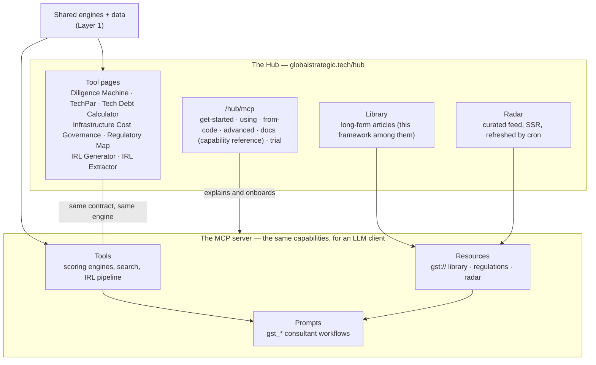
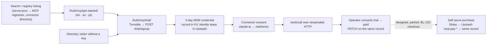

# Layer 3 — Product architecture

> Per the article: what the product does, how its components fit together, and where the build-versus-source boundaries fall. Product-architecture decisions _are_ strategy decisions — they fix core competency, cost structure and growth options. Business meaning: gross-margin potential, innovation velocity, M&A capacity, integration and customization complexity.

## What GST sells, and how it is composed

- **One capability, two surfaces.** A scoring tool exists once as an engine and is exposed twice: as a browser page in the Hub and as an MCP tool. The capability reference at `/hub/mcp/docs/` is an authored registry rendered server-side ([ADR-0023](../adr/0023-mcp-capability-docs-rendering.md)) with a job-oriented lens ([ADR-0026](../adr/0026-mcp-docs-task-lens-is-jobs.md)).
- **Prompts are the consultant workflow layer** — typed, versioned macros composing tools and resources ([ADR-0007](../adr/0007-registered-prompt-pattern.md)); extending a tool's inputs extends its companion prompt.
- **Structured output is the machine channel** and prose is the model channel, built by two constructors ([ADR-0011](../adr/0011-tool-response-channel-policy.md)).
- Per-primitive inventories, with counts, are in [ARCHITECTURE.md § The three MCP primitives](../../../mcp-server/src/docs/ARCHITECTURE.md#the-three-mcp-primitives-as-gst-uses-them) — not repeated here by rule.

## The funnel, from a page view to a working credential

- The trial is the **only fully self-serve path** in the estate today; conversion is an operator action on the same record, which is what [ADR-0036](../adr/0036-client-records-stay-in-kv.md) keeps cheap. The purchase step exists as a design ([PAYMENTS_PLATFORM_BL-133.md](../development/PAYMENTS_PLATFORM_BL-133.md)) waiting on a price ([BL-145](../development/BACKLOG.md#bl-145-design-partner-program--set-the-price-from-evidence-not-from-a-guess)).
- The onboarding pages are Tier A — every locale — under one template per route ([LOCALIZATION.md](../development/LOCALIZATION.md)); their screen-capture media is in git by decision ([ADR-0022](../adr/0022-mcp-onboarding-media-in-git.md)).
- Registry metadata is served by the Worker and parity-bound to the website's JSON-LD so the description exists once ([ADR-0033](../adr/0033-registry-metadata-served-by-the-worker.md)).

## Build-versus-source boundaries

| Sourced                              | Used for                                                                         | The boundary decision                                                                                                                                                                                 |
| ------------------------------------ | -------------------------------------------------------------------------------- | ----------------------------------------------------------------------------------------------------------------------------------------------------------------------------------------------------- |
| Cloudflare Workers, KV, AE           | The MCP server and its native stores                                             | Single Worker, hostname-split; no D1/DO ([ADR-0036](../adr/0036-client-records-stay-in-kv.md))                                                                                                        |
| Vercel                               | Static site, previews, headers                                                   | Static output; SSR only for Radar                                                                                                                                                                     |
| Upstash Redis                        | Rate limits, caches, leases                                                      | The one MCP DB; every consumer fails open except trial signup                                                                                                                                         |
| Inoreader                            | The Radar feed                                                                   | Budget-protected by a circuit breaker; live-import restricted by lint ([ADR-0004](../adr/0004-hub-surface-resources-import-restriction.md), [0006](../adr/0006-inoreader-zone1-budget-protection.md)) |
| `@cloudflare/workers-oauth-provider` | OAuth 2.1 authorization server                                                   | Embedded, not delegated to an IdP ([ADR-0008](../adr/0008-mcp-oauth-embedded-authorization-server.md))                                                                                                |
| Cloudflare Turnstile                 | Trial signup bot gate                                                            | Fails closed                                                                                                                                                                                          |
| Sentry ×2, GA4, Lighthouse           | Errors, product analytics, performance                                           | Separate Sentry projects per half of the estate                                                                                                                                                       |
| **Built**                            | Scoring engines, IRL pipeline, regulation corpus, design system, capability docs | The differentiated core — everything an acquirer would be buying                                                                                                                                      |

## Where this layer is bound

| Concern                    | Authoritative                                                                                                                                                                                                                                                                                                                                                                                                                                   |
| -------------------------- | ----------------------------------------------------------------------------------------------------------------------------------------------------------------------------------------------------------------------------------------------------------------------------------------------------------------------------------------------------------------------------------------------------------------------------------------------- |
| Hub tools                  | [hub/README.md](../hub/README.md)                                                                                                                                                                                                                                                                                                                                                                                                               |
| MCP onboarding and docs    | [MCP_ONBOARDING.md](../hub/MCP_ONBOARDING.md) · [MCP_CAPABILITY_DOCS.md](../hub/MCP_CAPABILITY_DOCS.md)                                                                                                                                                                                                                                                                                                                                         |
| Trial and payments designs | [SELF_SERVE_TRIAL_BL-155.md](../development/SELF_SERVE_TRIAL_BL-155.md) · [PAYMENTS_PLATFORM_BL-133.md](../development/PAYMENTS_PLATFORM_BL-133.md)                                                                                                                                                                                                                                                                                             |
| Page copy                  | the `gst-page-content` skill                                                                                                                                                                                                                                                                                                                                                                                                                    |
| ADRs                       | [0002](../adr/0002-irl-body-by-hash-cache.md) · [0003](../adr/0003-irl-xlsx-canonicalization-hash-bind.md) · [0007](../adr/0007-registered-prompt-pattern.md) · [0012](../adr/0012-rotating-feeds-are-noindex.md) · [0022](../adr/0022-mcp-onboarding-media-in-git.md) · [0023](../adr/0023-mcp-capability-docs-rendering.md) · [0026](../adr/0026-mcp-docs-task-lens-is-jobs.md) · [0034](../adr/0034-irl-verdict-events-emit-from-compose.md) |
