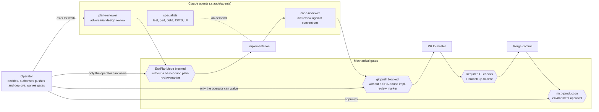

# Layer 4 — Organizational architecture

> Per the article: the internal structure of people, processes, incentives and decision-making, anchored on Conway's Law — the org chart becomes the system architecture by gravity. Business meaning: key-person dependencies, capability gaps, decision rights, incentive alignment, capacity to absorb change.

## This layer is thin, and that is the finding

GST is a **single-operator company**. There is no team topology to draw, no on-call rotation, no code-ownership map, no second reviewer. Stating that plainly is more useful to the audience this framework serves than manufacturing content would be: the key-person dependency is total, and every mechanism below exists to make one person's work survive review, handoff and absence.

## The working model that exists

- **Review is enforced by hooks, not by people.** A plan cannot leave plan mode without the reviewer's marker, and the marker is bound to the plan's content hash, so editing after review invalidates it. A push cannot leave the machine without a review bound to the exact HEAD. Both are documented in [DEVELOPER_TOOLING.md § Claude Code review gates](../development/DEVELOPER_TOOLING.md) and armed per machine.
- **Decision rights are explicit.** The operator alone waives a gate, authorises a push, and approves a production Worker deploy; an approved plan authorises only the pushes it names ([CLAUDE.md § Git Workflow](../../../.claude/CLAUDE.md)).
- **Institutional memory is written down or it does not exist.** Corrections go to a persistent memory that loads every session; repo conventions go to CLAUDE.md or the doc that owns them; decisions go to ADRs in the same PR; closed initiatives are distilled then archived. The backlog prunes completed work and records where its live content went.
- **The incentive structure is one directive**: no deferred tech debt — a fix that can land this session lands this session, and verification work counts as work.

## What would populate this layer at scale

Named so the gap is visible, not to plan it:

- A second human reviewer, which would let the hook-enforced gates become social ones.
- Code ownership per workspace (website vs. server) and per surface (auth, IRL pipeline, design system).
- An on-call rotation behind the SLO alert evaluator and the Sentry rules, which today page one person.
- A change-advisory step for the payments rail once it takes money.
- Documented handover: the archived initiative docs and the backlog's prune notes are the current substitute.

## Where this layer is bound

| Concern                       | Authoritative                                                                                                                                  |
| ----------------------------- | ---------------------------------------------------------------------------------------------------------------------------------------------- |
| Directives, gates, agents     | [.claude/CLAUDE.md](../../../.claude/CLAUDE.md)                                                                                                |
| Gate mechanics                | [DEVELOPER_TOOLING.md](../development/DEVELOPER_TOOLING.md)                                                                                    |
| Operator procedures           | [OPERATOR_RUNBOOK.md](../development/OPERATOR_RUNBOOK.md) · [PILOT_ONBOARDING.md](../../../mcp-server/src/docs/operations/PILOT_ONBOARDING.md) |
| Initiative lifecycle, backlog | [development/README.md](../development/README.md) · [BACKLOG.md](../development/BACKLOG.md)                                                    |
