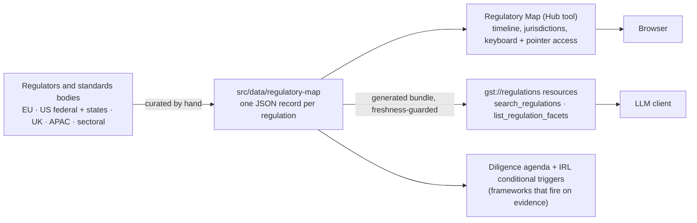

# Layer 5 — Industry & regulatory architecture (externalities)

> Per the article: the external forces, standards and competitive dynamics that constrain choices before any internal decision is made. Business meaning: which business models are viable, where margins concentrate, how defensible advantage can be built, which constraints are non-negotiable.

This layer is **not** thin for GST. The product speaks a protocol it does not control, authenticates by standards it did not write, ships in a browser security model set by others, and — unusually — sells an index of regulation as a product. Each of those is a dependency with an owner.

## The standards the estate is bound by

```mermaid
flowchart TB
  subgraph protocol["Protocol — owned by the MCP project"]
    mcp["Model Context Protocol<br/>revision 2026-07-28 on the Worker<br/>streamable HTTP · tools/resources/prompts"]
    sep["SEPs and registry schema<br/>server.json, connector directory"]
  end
  subgraph authstd["Authentication — IETF"]
    o21["OAuth 2.1 (PKCE S256 only)"]
    rfcs["RFC 6749 · 7523 private_key_jwt · 7662 introspection<br/>8414 AS metadata · 9728 protected-resource metadata"]
  end
  subgraph web["Web platform — browser vendors, W3C"]
    csp["CSP · HSTS (preload) · frame-ancestors none<br/>Permissions-Policy · Referrer-Policy"]
    bimi["BIMI / DMARC (email identity)"]
  end
  subgraph law["Law and privacy"]
    gdpr["GDPR / ePrivacy — consent<br/>(BL-001 open; GA4 decision on record)"]
    tax["Sales tax / VAT on a digital good<br/>(the payments design's vendor question)"]
  end
  subgraph market["Market structure"]
    pe["PE / M&A diligence cadence:<br/>2–6 week bursts, quiet between"]
    llm["LLM client platforms<br/>claude.ai connector directory as a channel"]
  end

  mcp --> worker["The Worker's transport, CORS and per-request server (L1)"]
  o21 --> worker
  rfcs --> worker
  csp --> site["vercel.json headers + SSR middleware mirror (L1/L2)"]
  gdpr --> analytics["What the site may load before consent (L2)"]
  pe --> pricing["Pricing unit: per-deal vs annual seat (L3, BL-145)"]
  llm --> funnel["The funnel's top of page (L3)"]
```

- **The protocol revision is a load-bearing constant.** The Worker serves `2026-07-28` while stdio keeps the legacy era; the split is a decision, not an accident ([ADR-0013](../adr/0013-mcp-2026-07-28-modern-only-worker.md)), and a future revision is a Layer-5 shift that reaches Layer 1 directly.
- **Auth is standards all the way down**, embedded rather than delegated ([ADR-0008](../adr/0008-mcp-oauth-embedded-authorization-server.md)); the RFC set is the contract an enterprise client's security review will read.
- **The browser security model is applied twice** — CDN headers for static assets and a middleware mirror for SSR — because Vercel's header rules do not cover server-rendered responses ([SECURITY_HEADERS.md](../security/SECURITY_HEADERS.md)). Adding any external script is a CSP change in two files.
- **Consent is an open item by decision, not omission.** GA4 loads unconditionally; BL-001 stays open; paid targeting is geo-limited and organic EU exposure is accepted — recorded in [GOOGLE_ANALYTICS.md](../analytics/GOOGLE_ANALYTICS.md) so nobody re-litigates it from a scan result.
- **The market's rhythm sets the pricing unit.** Diligence comes in bursts; whether a standing job carries the quiet months is the question BL-145 exists to answer from evidence before a price is shown.

## The product indexes regulation — the L5→L3 coupling

- The regulatory corpus is **Layer-5 content held as Layer-1 data**: a change in the world becomes a JSON edit, then a regenerated bundle, then a new tool result — with a test that fails when the bundle is stale.
- The same corpus feeds the diligence engines: a framework can fire as a conditional trigger from IRL evidence, which is how an external constraint becomes a line in a dossier.
- The article's own diligence request — _a regulatory compliance matrix mapping requirements to architectural components_ — is what the Map is for, and the reason this layer is the richer one here.

## Where this layer is bound

| Concern                         | Authoritative                                                                                                                                                                                                                                                                                             |
| ------------------------------- | --------------------------------------------------------------------------------------------------------------------------------------------------------------------------------------------------------------------------------------------------------------------------------------------------------- |
| Protocol era and origin policy  | [ARCHITECTURE.md § Auth, CORS & deploy topology](../../../mcp-server/src/docs/ARCHITECTURE.md#auth-cors--deploy-topology)                                                                                                                                                                                 |
| Auth standards as implemented   | [AUTH.md](../../../mcp-server/src/docs/operations/AUTH.md) · [REMOTE_CLIENT_SETUP.md](../../../mcp-server/src/docs/operations/REMOTE_CLIENT_SETUP.md)                                                                                                                                                     |
| Security headers, CSP allowlist | [SECURITY_HEADERS.md](../security/SECURITY_HEADERS.md) · [security/README.md](../security/README.md)                                                                                                                                                                                                      |
| Consent posture                 | [GOOGLE_ANALYTICS.md](../analytics/GOOGLE_ANALYTICS.md) · [BACKLOG § BL-001](../development/BACKLOG.md#bl-001-cookie-consent-and-gdpr-compliance)                                                                                                                                                         |
| The regulation corpus           | [REGULATORY_MAP.md](../hub/REGULATORY_MAP.md)                                                                                                                                                                                                                                                             |
| Pricing and market evidence     | [BACKLOG § BL-145](../development/BACKLOG.md#bl-145-design-partner-program--set-the-price-from-evidence-not-from-a-guess) · [PAYMENTS_PLATFORM_BL-133.md](../development/PAYMENTS_PLATFORM_BL-133.md)                                                                                                     |
| ADRs                            | [0008](../adr/0008-mcp-oauth-embedded-authorization-server.md) · [0009](../adr/0009-compliance-audit-log-hash-chain.md) · [0013](../adr/0013-mcp-2026-07-28-modern-only-worker.md) · [0014](../adr/0014-deactivate-audit-pipeline.md) · [0017](../adr/0017-audit-levels-enforced-in-the-tool-response.md) |
