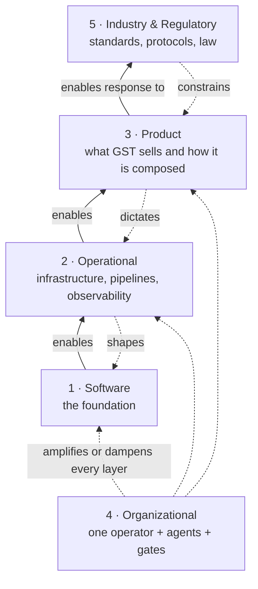

# GST Architecture Reference — the estate in five layers

> **Audience**: anyone who needs the whole GST estate legible at once — an acquirer's diligence team, a new contributor, or the operator handing it to either. The **website** (Astro on Vercel) and the **MCP server** (a Cloudflare Worker) are one estate here, not two projects.
>
> **What this is**: a map. Each layer file draws the cross-cutting views that no single reference doc holds, and points at the maintained doc that owns the detail. A map is not a second territory — see [§ What is drawn and what is linked](#what-is-drawn-and-what-is-linked).

## The framing

The five layers are the ones in GST's own [_Business Architectures_](../../data/library/business-architectures/article.md) article, read **foundation-up**, because each layer inherits the possibilities and limitations of the one below it. The article says other reasonable framings exist; this directory uses this one because it is the lens GST sells, so the estate should survive its own diagnostic.

| #   | Layer                                             | For GST, in one line                                                                                                                     |
| --- | ------------------------------------------------- | ---------------------------------------------------------------------------------------------------------------------------------------- |
| 1   | [Software](1-software.md)                         | Two npm workspaces, one shared engine core, three auth paths, one Worker that speaks MCP over HTTP.                                      |
| 2   | [Operational](2-operational.md)                   | Vercel for the site, Cloudflare for the server; four stores plus Upstash and Analytics Engine; twelve workflows; two Sentrys.            |
| 3   | [Product](3-product.md)                           | The Hub tools, the MCP capability surface, the Library and Radar, and the funnel from a page view to a minted credential.                |
| 4   | [Organizational](4-organizational.md)             | One operator, agents as reviewers, and hook-enforced gates standing in for a team. Thin by fact, and says so.                            |
| 5   | [Industry & Regulatory](5-industry-regulatory.md) | The MCP protocol, OAuth 2.1 and its RFCs, the web platform's security model, privacy law — and a product that indexes regulation itself. |

Solid arrows are the article's **bottom-up enablement**; dotted arrows are its **top-down constraints**; Layer 4 runs **laterally** beside all of them.

## How the layers interact, applied to GST

The article's four interaction rules, each with the concrete instance that shows it in this estate:

- **Bottom-up enablement.** The Worker registers every tool once and serves it over two transports (L1, [ARCHITECTURE.md § Register-once, transport-twice](../../../mcp-server/src/docs/ARCHITECTURE.md#register-once-transport-twice)); that is what let a staging Worker auto-deploy from a green test run (L2), which is what let a self-serve trial ship without an ops runbook per client (L3).
- **Top-down constraints.** The MCP protocol revision the Worker serves (L5, [ADR-0013](../adr/0013-mcp-2026-07-28-modern-only-worker.md)) fixed the transport as streamable HTTP and the origin policy as CORS; that dictated a per-request server build (L2) and the stateless one-POST-per-call shape every client and probe uses (L1).
- **Lateral coupling.** A single operator (L4) cannot be their own second reviewer, so the review gates are hook-enforced rather than social ([CLAUDE.md § Directives 2 and 7](../../../.claude/CLAUDE.md)), and the Worker's production deploy waits on a GitHub Environment approval rather than a colleague (L2).
- **The cross-layer diagnostic.** The six-week flake in the server test suite (BL-149) turned out to be a first-use cost every `unstable_dev` file pays; the _organizational_ decision that fixed it was a standing rule — warm the Worker in `beforeAll` — written into CLAUDE.md, not a timeout.

The article's failure pattern — changing one layer without the others — has its own instance here: the payments rail ([BL-133](../development/PAYMENTS_PLATFORM_BL-133.md)) was designed L3-first and then parked when its L2 substrate question (where customer state lives) had not been answered. [ADR-0036](../adr/0036-client-records-stay-in-kv.md) answers it.

## What is drawn and what is linked

Layers 1 and 2 are already documented in depth by the MCP server's maintained reference, whose anchors code comments cite as load-bearing. The rule for this directory is: **a layer file draws only a view that no maintained doc holds, and links the rest.** The table is the proof, per section rather than by principle.

| Maintained source                                                                                                                | This directory…                                                                                                                           |
| -------------------------------------------------------------------------------------------------------------------------------- | ----------------------------------------------------------------------------------------------------------------------------------------- |
| [ARCHITECTURE.md § System shape](../../../mcp-server/src/docs/ARCHITECTURE.md#system-shape)                                      | **Links.** L1 draws the two-workspace estate map, which spans both platforms; the server's own shape and its primitive counts stay there. |
| [ARCHITECTURE.md § Remote transport & request flow](../../../mcp-server/src/docs/ARCHITECTURE.md#remote-transport--request-flow) | **Links.** L1 draws only the estate-level request paths (browser → Vercel, client → Worker); the fetch pipeline stays there.              |
| [ARCHITECTURE.md § Auth, CORS & deploy topology](../../../mcp-server/src/docs/ARCHITECTURE.md#auth-cors--deploy-topology)        | **Draws one view**: the three auth paths as a routing decision (L1). Deploy topology is drawn in L2 only as the cross-platform picture.   |
| [ARCHITECTURE.md § Radar pipeline](../../../mcp-server/src/docs/ARCHITECTURE.md#radar-pipeline-single-caller-unification)        | **Links.** Appears in L3 as one product surface among several, not redrawn.                                                               |
| [ARCHITECTURE.md § Observability](../../../mcp-server/src/docs/ARCHITECTURE.md#observability)                                    | **Draws one view**: the estate-wide signal flow across both Sentrys, AE, the status page and the probe (L2).                              |
| [DEPLOY.md](../../../mcp-server/src/docs/operations/DEPLOY.md)                                                                   | **Links.** L2's deploy diagram is the cross-platform view; every step and secret stays in the runbook.                                    |
| [SECRETS_INVENTORY.md](../operations/SECRETS_INVENTORY.md)                                                                       | **Links.** No individual secret name, value or namespace id appears in this directory.                                                    |
| [LOCALIZATION.md](../development/LOCALIZATION.md)                                                                                | **Links.** L3 names the locale model in one sentence.                                                                                     |
| [STYLES_GUIDE.md](../styles/STYLES_GUIDE.md)                                                                                     | **Links.** Not an architecture concern at this altitude.                                                                                  |
| [DEVELOPER_TOOLING.md](../development/DEVELOPER_TOOLING.md)                                                                      | **Draws one view**: the workflow graph (L2). The pipeline map with its triggers and path filters stays there.                             |
| [SECURITY_HEADERS.md](../security/SECURITY_HEADERS.md)                                                                           | **Links.** L5 names the model (CSP, HSTS, framing) and where it is applied.                                                               |
| [CLAUDE.md § Project Structure](../../../.claude/CLAUDE.md)                                                                      | **Links.** The directory tree is not reproduced; L1's estate map is by platform and boundary, not by folder.                              |
| [adr/](../adr/README.md)                                                                                                         | **Links.** Each layer file ends with the ADRs that bind it.                                                                               |

Two hard rules follow from the table. **No tool, prompt or resource counts appear anywhere in this directory** — `tests/integration/mcp-published-tool-count.test.ts` pins those figures in four docs, and a fifth uncontrolled copy would drift. And **no individual secret names, no secret values, no hostnames beyond the public ones, and no namespace ids** — the inventory owns those. An env-var _family_ name is not a secret and may appear where the mechanism needs it (L1 names the `MCP_KEY_*` family to show how a static bearer resolves its owner); a specific variable, its value, or a namespace id may not.

## Conventions for this directory

- **Diagrams are mermaid in fenced blocks** ([ADR-0037](../adr/0037-architecture-reference-diagrams-are-mermaid.md)). That is a convention **for this directory only**: it is not a repo-wide ruling, and the ASCII box-drawing figures in other maintained docs are not converted.
- **Nothing in CI renders mermaid.** `test:docs` checks links and anchors, and skips links inside fenced blocks. Before committing a change here, render every block with a pinned mermaid build (`11.17.2`) and look at the output — a broken diagram passes CI and fails silently on GitHub.
- **Reading order is the numeric prefix.** Foundation up.

## Not a claim of completeness

These are reference diagrams, not a governance artifact. They use the article's framing; the article itself says other reasonable framings exist. A diagram here that has not been updated is out of date, not authoritative — the maintained docs and ADRs it links are.

---

_Created 2026-09-19 (BL-154 Slice 2)._
