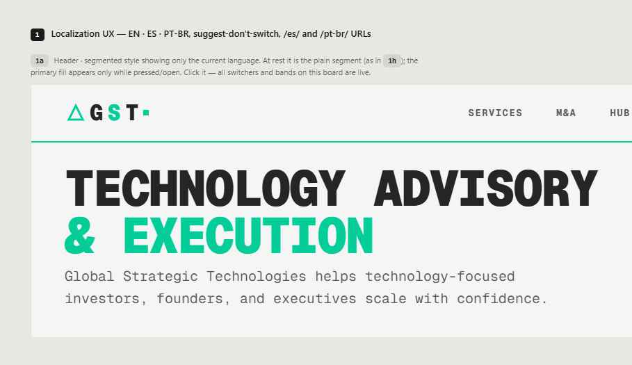
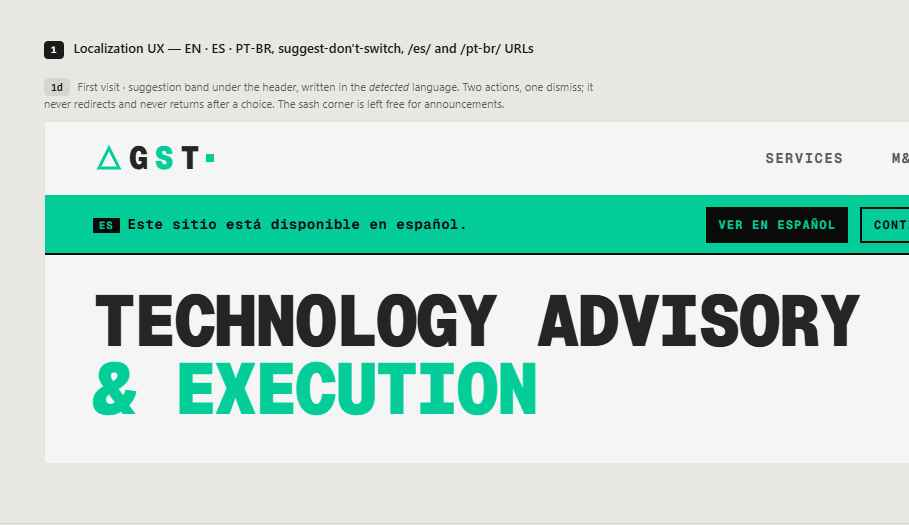
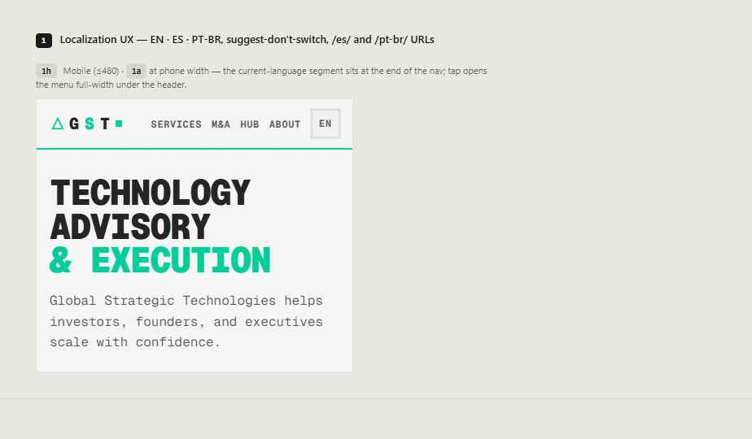
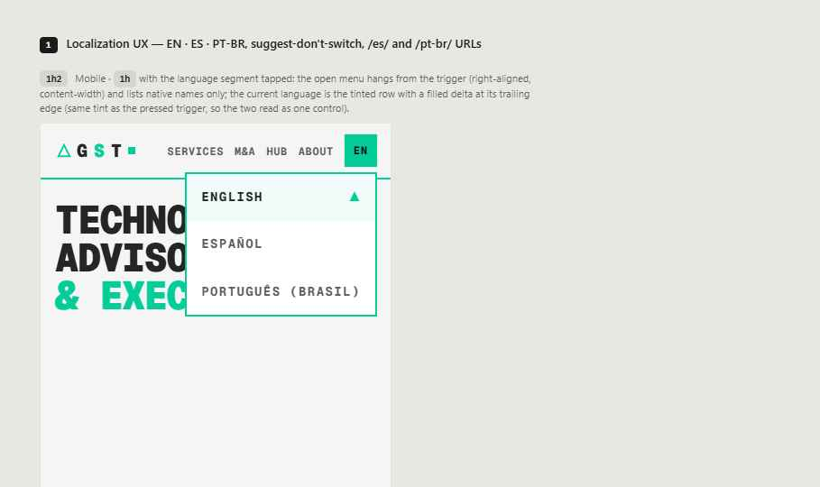
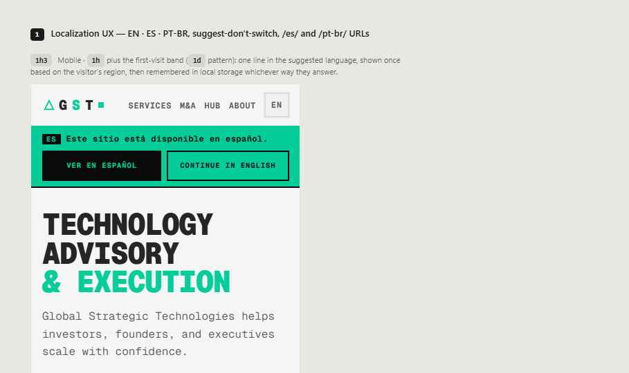
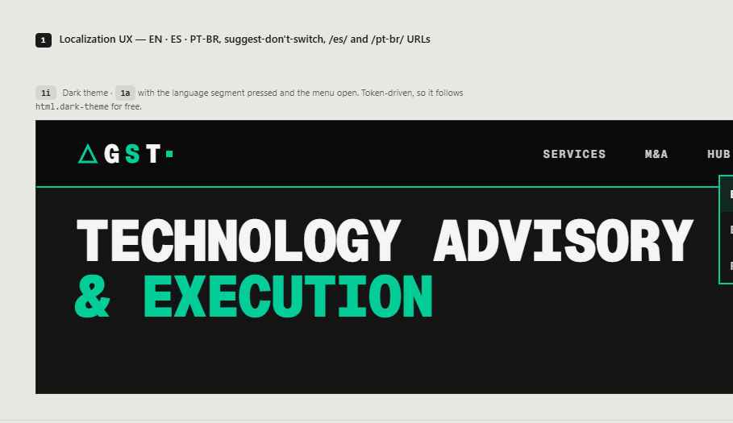

# Design hand-off: GST Website Localization (EN · ES · PT-BR) — BL-153

> **Status: open initiative doc.** This is the Claude Design hand-off for [BL-153](BACKLOG.md#bl-153-website-localization--spanish-and-brazilian-portuguese-on-an-architecture-that-can-carry-dialects-and-regions-later), received 2026-09-05, reproduced verbatim below the horizontal rule with only its file references adjusted. Its §1–§3 values are restated as maintained facts in [LOCALIZATION.md](LOCALIZATION.md) and [ADR-0030](../adr/0030-website-locale-model.md); §4 (hub-tool currency control) is Tier B and is not built by BL-153. The interactive prototype it describes (`Localization UX.dc.html`, `support.js`, `_ds/`) is **not committed** — Claude Design is its source of truth. At closure this doc is archived per the [initiative-doc lifecycle](README.md#initiative-doc-lifecycle-convention-codified-2026-07-15-under-bl-088).

## Screenshots

| Option | Screenshot                                                                           |
| ------ | ------------------------------------------------------------------------------------ |
| `1a`   |  |
| `1d`   |          |
| `1h`   |              |
| `1h2`  |                 |
| `1h3`  |      |
| `1i`   |                |

---

# Handoff: GST Website Localization (EN · ES · PT-BR)

Target repo: `Global-Strategic-Technologies/gst-website` (Astro, static build, Vercel). Design system: the site's own `styles.css` / `.brutal-*` vocabulary.

## Overview

Add three-language support to the GST website with one unified UX:

1. A **language switcher** in the site header — a single collapsed segment showing the current language code; click opens a menu with native language names.
2. A **first-visit suggestion band** under the header, written in the suggested language, shown once, remembered in `localStorage`. It never redirects.
3. **Locale-prefixed URLs** (`/`, `/es/`, `/pt-br/`) with `hreflang` + `x-default` on every page.
4. **Locale-aware formatting** in hub tools (numbers/dates via `Intl`); currency remains a user choice, never inferred from language.

## About the design files

`Localization UX.dc.html` (plus `_ds/` and `support.js`) is a **design reference built in HTML** — an interactive prototype showing intended look and behaviour. Do not ship it. Recreate the behaviour in Astro components using the repo's existing patterns (`Header.astro`, `HeaderNavLinks.astro`, `BaseLayout.astro`, `src/data/announcements.ts` style registries, `styles.css` tokens).

Fidelity: **high**. Match spacing, tokens and states exactly; every value below is a token that already exists in `styles.css`.

## Option map (ids in the prototype)

- `1a` — desktop header, switcher at rest and pressed (light)
- `1i` — same, dark theme, menu open
- `1h` — mobile (≤480) header at rest
- `1h2` — mobile, menu open
- `1h3` — mobile with first-visit band
- `1d` — desktop first-visit band

All switchers and bands in the prototype are live: click to see pressed/open, pick a language, dismiss a band.

---

## 1. Language switcher

### Placement

Last item of the main nav `<ul>` (`HeaderNavLinks.astro`), after **About**. It is an `<li style="position:relative">` so the menu anchors to it. Nothing in the footer.

### Trigger — markup

```html
<li class="lang-switch">
  <div
    class="brutal-segmented brutal-segmented--sm"
    role="group"
    aria-label="Language"
    style="max-width:none"
  >
    <button
      class="brutal-segmented__btn"
      type="button"
      aria-haspopup="menu"
      aria-expanded="false"
      aria-label="Language: English"
      lang="en"
    >
      EN
    </button>
  </div>
  <div class="lang-menu" role="menu" hidden>…</div>
</li>
```

Only **one** segment is rendered — the current language. Code shown is the **short code**: `EN`, `ES`, `PT` (never `PT-BR` in the header; keeps width constant, avoids nav reflow).

### Trigger — states

| State                                   | Classes / style                                                                                                                                                    |
| --------------------------------------- | ------------------------------------------------------------------------------------------------------------------------------------------------------------------ |
| Rest                                    | `.brutal-segmented__btn` only. Text `--text-secondary`, transparent bg, container border `--border-light` (dark: `--border-dark-default`).                         |
| Hover                                   | System default: text → `--text-primary`.                                                                                                                           |
| Pressed / open (`aria-expanded="true"`) | Add `.brutal-segmented__btn--active` (fill `--color-primary`, ink `--bg-dark`) **and** set the `.brutal-segmented` container `border-color: var(--color-primary)`. |
| Focus                                   | `outline: 2px solid var(--color-primary); outline-offset: 2px` on `:focus-visible`.                                                                                |

Sizes: desktop button `min-height: 36px; padding: 0 var(--spacing-md)`; ≤480px `min-height: 32px; padding: 0 var(--spacing-sm)`. Font: `--font-family-mono`, `--text-xs`, `--font-weight-bold`, uppercase, letter-spacing `.06em` (inherited from the class).

The primary-green fill is **only** the pressed/open feedback — never the resting state.

### Menu — markup

```html
<div class="lang-menu" role="menu">
  <a role="menuitem" href="/" lang="en" aria-current="page">
    <span>English</span>
    <svg viewBox="0 0 64 64" width="14" height="14" aria-hidden="true">
      <path
        d="M32 12 L52 52 L12 52 Z"
        fill="currentColor"
        stroke="currentColor"
        stroke-width="6"
        stroke-linejoin="miter"
      />
    </svg>
  </a>
  <a role="menuitem" href="/es/" lang="es"><span>Español</span></a>
  <a role="menuitem" href="/pt-br/" lang="pt-BR"><span>Português (Brasil)</span></a>
</div>
```

Menu items show **native full names only** (no code column). The current item carries `aria-current="page"` and the filled brand delta (14px, `--color-primary`) at its trailing edge.

### Menu — styles (no existing DS class; compose from tokens)

```css
.lang-menu {
  position: absolute;
  right: 0;
  top: calc(100% + 6px);
  min-width: 0; /* content-width, right-aligned */
  background: var(--bg-light); /* dark theme resolves via light-dark tokens */
  border: 2px solid var(--color-primary);
  z-index: var(--z-dropdown);
  text-align: left;
}
.lang-menu a {
  display: flex;
  justify-content: space-between;
  align-items: center;
  gap: var(--spacing-md);
  padding: var(--spacing-sm) var(--spacing-md);
  min-height: 44px;
  box-sizing: border-box;
  white-space: nowrap;
  font-family: var(--font-family-mono);
  font-size: var(--text-xs);
  font-weight: var(--font-weight-bold);
  text-transform: uppercase;
  letter-spacing: 0.08em;
  color: var(--text-secondary);
  text-decoration: none;
  border-bottom: 1px solid var(--border-light); /* dark: --border-dark-subtle */
}
.lang-menu a:last-child {
  border-bottom: none;
}
.lang-menu a:hover {
  background: var(--accent-tint-bg);
  color: var(--text-primary);
}
.lang-menu a[aria-current] {
  background: var(--accent-tint-bg);
  color: var(--text-primary);
}
@media (max-width: 480px) {
  .lang-menu a {
    min-height: 52px;
    padding: 0 1rem;
  }
}
```

No border-radius anywhere. No drop shadows. The header (`.site-header`) already has `z-index: var(--z-sticky)`; the menu must stack above the suggestion band that follows it.

### Behaviour

- Click/Enter/Space on trigger toggles `aria-expanded` and menu visibility.
- `Esc`, outside click, or focus leaving the menu closes it and returns focus to the trigger.
- Arrow keys move between `menuitem`s; Home/End jump.
- Choosing an item navigates to the same path under the new locale prefix (see §3) and writes `localStorage.gstLang = <code>`.
- When JS is unavailable the trigger degrades to a plain link to the current locale root; menu items are real links so navigation always works.

---

## 2. First-visit suggestion band

### When it shows

On first navigation only, when the suggested language ≠ current locale and `localStorage.gstLang` is unset. Suggestion source: `Accept-Language` / `navigator.languages` (region signal), never IP geolocation. Rendered in the **suggested** language. Any interaction (accept, decline, close) writes `gstLang` and the band never returns. It never auto-redirects.

### Placement

Directly under `<header class="site-header">`, in flow (pushes content down; no overlay). The sash corner stays free for announcements.

### Desktop markup (≥481px)

```html
<div class="lang-band" role="region" aria-label="Sugerencia de idioma" lang="es">
  <div class="container">
    <p><span class="lang-band__code">ES</span>Este sitio está disponible en español.</p>
    <div class="lang-band__actions">
      <a class="lang-band__accept" href="/es/">Ver en español</a>
      <button class="lang-band__decline" type="button">Continue in English</button>
      <button class="lang-band__close" type="button" aria-label="Cerrar">
        ✕ (14px stroke SVG)
      </button>
    </div>
  </div>
</div>
```

Copy per suggested language:

- ES: "Este sitio está disponible en español." / "Ver en español" / decline stays in the _current_ language ("Continue in English").
- PT-BR: "Este site está disponível em português." / "Ver em português".
- EN (on an /es/ or /pt-br/ page): "This site is available in English." / "View in English" / decline in the page's language ("Continuar en español" / "Continuar em português").

### Styles

```css
.lang-band {
  background: var(--color-primary);
  color: var(--bg-dark);
  border-bottom: 2px solid var(--bg-dark);
}
.lang-band .container {
  display: flex;
  align-items: center;
  justify-content: space-between;
  gap: var(--spacing-xl);
  min-height: 56px;
  padding-top: var(--spacing-xs);
  padding-bottom: var(--spacing-xs);
}
.lang-band p {
  margin: 0;
  font-family: var(--font-family-mono);
  font-size: var(--text-sm);
  font-weight: var(--font-weight-bold);
  letter-spacing: 0.04em;
}
.lang-band__code {
  background: var(--bg-dark);
  color: var(--color-primary);
  padding: 0.0625rem 0.375rem;
  margin-right: var(--spacing-sm);
  font-size: var(--text-2xs);
  letter-spacing: 0.1em;
  text-transform: uppercase;
}
.lang-band__actions {
  display: flex;
  align-items: center;
  gap: var(--spacing-md);
}
.lang-band__accept {
  background: var(--bg-dark);
  color: var(--color-primary);
  text-decoration: none;
  min-height: 36px;
  padding: 0 var(--spacing-md);
  display: flex;
  align-items: center;
  font-size: var(--text-xs);
  font-weight: var(--font-weight-bold);
  letter-spacing: 0.1em;
  text-transform: uppercase;
}
.lang-band__decline {
  background: none;
  border: 2px solid var(--bg-dark);
  color: var(--bg-dark);
  min-height: 36px;
  padding: 0 var(--spacing-md);
  font: inherit;
  font-size: var(--text-xs);
  font-weight: var(--font-weight-bold);
  letter-spacing: 0.1em;
  text-transform: uppercase;
  cursor: pointer;
}
.lang-band__close {
  background: none;
  border: none;
  color: var(--bg-dark);
  width: 36px;
  height: 36px;
  display: flex;
  align-items: center;
  justify-content: center;
  cursor: pointer;
}

@media (max-width: 480px) {
  .lang-band .container {
    flex-direction: column;
    align-items: stretch;
    gap: var(--spacing-sm);
    padding: var(--spacing-sm) 1rem;
  }
  .lang-band p {
    font-size: var(--text-xs);
  }
  .lang-band__actions {
    gap: var(--spacing-sm);
  }
  .lang-band__accept,
  .lang-band__decline {
    flex: 1;
    justify-content: center;
    min-height: 44px;
    font-size: var(--text-2xs);
    white-space: nowrap;
  }
  .lang-band__close {
    display: none;
  } /* decline is the dismiss on mobile */
}
```

`--color-primary` and `--bg-dark` are identical in both themes, so the band needs no dark-mode rules. Contrast (teal `#05cd99` on `#0a0a0a`) passes AA.

---

## 3. Routing, SEO, persistence

- Locales: `en` (default, no prefix), `es` → `/es/…`, `pt-BR` → `/pt-br/…`. Use Astro i18n routing (`prefixDefaultLocale: false`).
- `<html lang>` = `en` / `es` / `pt-BR`.
- Every page emits `<link rel="alternate" hreflang="…">` for each locale that has that page, plus `hreflang="x-default"` → the English URL. Omit a locale's link when the page is not translated.
- Switcher targets the **same path** in the other locale; if the translation doesn't exist, fall back to that locale's home.
- `localStorage.gstLang`: set on any switcher pick or band interaction; read only to suppress the band. Do not redirect from it. Never clear other keys.
- Sitemap includes all locale URLs; middleware security headers unchanged.

## 4. Hub tools — locale-aware formats

- Numbers, percentages and dates format with `Intl.NumberFormat` / `Intl.DateTimeFormat` using the page locale (`pt-BR`: `R$ 2.480.000`, `14,2 %`, `04/09/2026`).
- Currency (`BRL`/`USD`/`EUR`) is a separate `.brutal-segmented` control in the tool action bar; default follows locale (pt-BR→BRL, es→EUR/USD per tool, en→USD) but the user's choice wins and is stored per tool. Values are **not** converted.
- Tool methodology note states the formatting rule in the page language.

## 5. Conventions (binding)

- Two-letter codes, never flags. `PT` in the header, `Português (Brasil)` in the menu.
- Every colour/space/size is a `var(--token)`; no hex, no radius, no blurred shadows.
- Icons are inline SVG with `currentColor`; the only mark is the brand delta (`M32 12 L52 52 L12 52`).
- Type is `--font-family-mono`, uppercase labels, letter-spacing per class.
- Interactive targets ≥ 44px on mobile (`--touch-target-min`); 36/32px in the desktop/mobile header is the existing nav density.
- Motion: none beyond `--transition-fast` colour/border changes. Menu appears/disappears without animation.
- Wrap in `@media (prefers-reduced-motion: reduce)` if any motion is added.

## 6. Acceptance checklist

- [ ] Header shows exactly one segment with `EN`/`ES`/`PT`; width stable across languages.
- [ ] Segment is plain at rest; primary fill + primary container border only while open.
- [ ] Menu: right-aligned, content-width, native names, current row tinted with delta marker, 44px rows (52px ≤480).
- [ ] Keyboard: Enter/Space opens, arrows navigate, Esc closes and restores focus.
- [ ] Band shows once per device, in suggested language, in flow under header, never redirects, remembered in `localStorage.gstLang`.
- [ ] `/es/` and `/pt-br/` prefixes, `hreflang` + `x-default` on every page, `<html lang>` correct.
- [ ] Dark theme renders correctly with no extra CSS (tokens only).
- [ ] Hub tool numbers/dates follow locale; currency is user-selectable and not converted.

## Files (as delivered; prototype not committed)

- `Localization UX.dc.html` — interactive prototype (options 1a, 1d, 1h, 1h2, 1h3, 1i). Lives in Claude Design.
- `_ds/…/styles.css`, `_ds_bundle.css` — the design system stylesheet the prototype loads (same as repo `styles.css`).
- `support.js` — prototype runtime only; ignore.
- `screenshots/` — the six PNGs, now at `assets/localization-handoff/` (table at the top of this doc).
